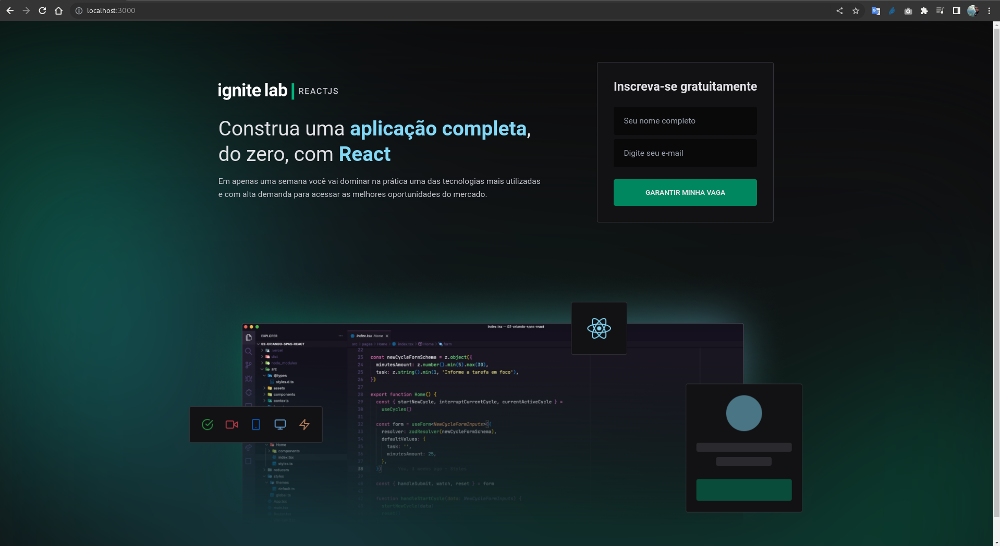
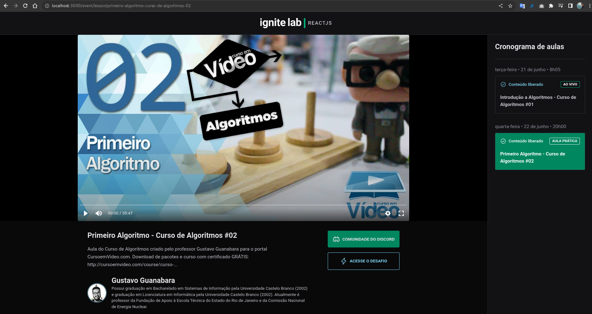

# Projeto Frontend com ReactJS

### Objetivo:

Desenvolvimento de um pequeno projeto com base nas aulas da semana de especialização em ReactJS, promovido pela Rocketseat em Junho de 2022. 

### O projeto: 

- Consiste em implementar uma interface web de video-aulas, utilizando um Headless CMS (nesse projeto, o GraphCMS); 
- Seguir o [Mockup no Figma](https://www.figma.com/file/jsw3tajCOegJOxVP8KwuyN/Plataforma-de-evento---Ignite-Lab-(Community)?node-id=0%3A1) proposto no evento;
- Estruturação inicial do projeto foi feita com [Vite](https://vitejs.dev/);
- Estilização foi baseada no [TailwindCSS](https://tailwindcss.com/);
- Consumo de dados em GraphQL via [GraphCMS](https://graphcms.com/) para carregar nas páginas;
- Hospedar o projeto na [Vercel](https://vercel.com/) integrado com a conta e repositório desse projeto no GitHub;


### Utilitários nesse projeto:

- [Vite](https://vitejs.dev/)
- [TailwindCSS](https://tailwindcss.com/) para estilização das páginas;
- [PostCSS](https://postcss.org/)
- [Autoprefixer](https://github.com/postcss/autoprefixer)
- [ApolloClient](https://www.apollographql.com/)
- [Graphql](https://graphql.org/)
- [Phosphor Icons](https://phosphoricons.com/)
- [VimeJS](https://vimejs.com/)
- [GraphQL Code Generator](https://www.graphql-code-generator.com/)
- [Vercel](https://vercel.com/)
- [NVM (Node Version Manager)](https://github.com/nvm-sh/nvm#installing-and-updating) para gerenciamento da versão do NodeJS;


### Configuração inicial desse projeto:

1. Esse projeto foi estruturado e iniciado usando o [ViteJS](https://vitejs.dev/)

    ```
    npm create vite@latest
    ```

2. Alterar arquivo `tailwindcss.config.js` para informar quais arquivos sejam reconhecidos e tenham os estilos compilados pelo Tailwind:

    ```
    ...
    content: [
        './src/**/*.tsx',
    ],
    ...
    ```
    No caso acima, todos os arquivos `.tsx`.


### Dependências: 

1. Dependências de Desenvolvimento:

    ```
    $ npm i tailwindcss postcss autoprefixer -D
    ```

2. Criar arquivo de configuração do PostCSS:

    ```
    npx tailwindcss init -p
    ```

3. Instalar as dependências do ApolloClient e Graphql:

    ```
    npm i @apollo/client graphql
    ```

4. Biblioteca de ícones Phosphor:

    ```
    npm i phosphor-react
    ```

5. Biblioteca de datas com Javascript:

    ```
    npm i date-fns
    ```

6. Biblioteca de player de vídeo:

    ```
    npm i @vime/core @vime/react --force
    ```

    - Nesse momento o VimeJS não suporta uma das features do React 18, o [Streaming Server-side Rendering (SSR)](https://nextjs.org/docs/advanced-features/react-18/streaming) e com isso não permite a instalação normal;

    - Portanto, deve-se utilizar o `--force` na instalação da biblioteca para conseguir instalar e começar a usar;

7. Biblioteca de roteamento de endereços URL:

    ```
    npm i react-router-dom
    ```

8. Biblioteca de auxílio à estilização condicional no CSS:

    ```
    npm i classnames
    ```

    - A exemplo: uma classe precisar ser aplicada quando determinado valor for satisfeito

9. GraphQL Code Generator: plugin de manipulação e tipificação 'nativa' com GraphQL dentro do ReactJS:

    ```
    npm i @graphql-codegen/cli
    npm i @graphql-codegen/typescript 
    npm i @graphql-codegen/typescript-operations 
    npm i @graphql-codegen/typescript-react-apollo -D
    ```

    - Através desse plugin não será mais necessário tipar todas as estruturas de retorno (response) das consultas (query) em GraphQL;
    - Como este projeto utiliza Apollo Client, basta utilizar o plugin para [Apollo and URQL](https://www.graphql-code-generator.com/docs/guides/react#apollo-and-urql);
    - Toda configuração do plugin está contida no arquivo codegen.yml;


### Variáveis de ambiente:

1. VITE_API_URL => URL da API do GraphCMS
2. VITE_API_ACCESS_TOKEN => Access Token da API do GraphCMS


### Prints



